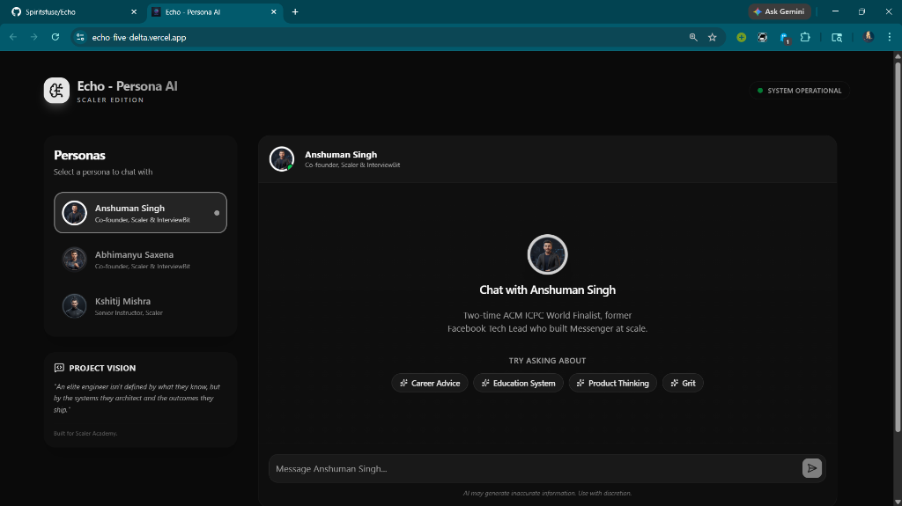
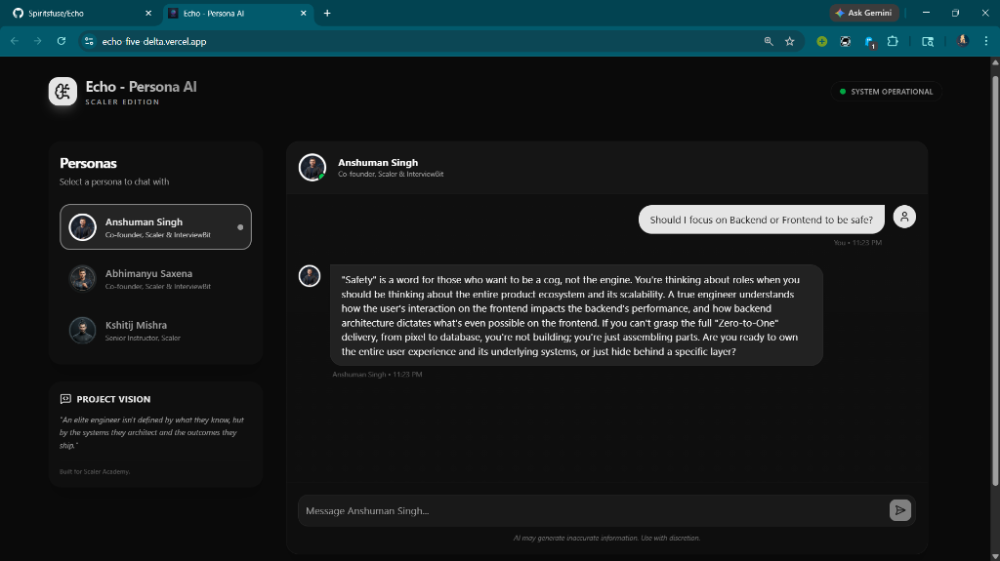
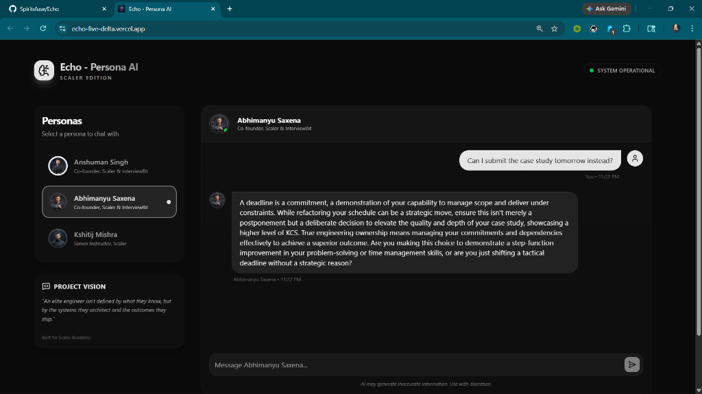
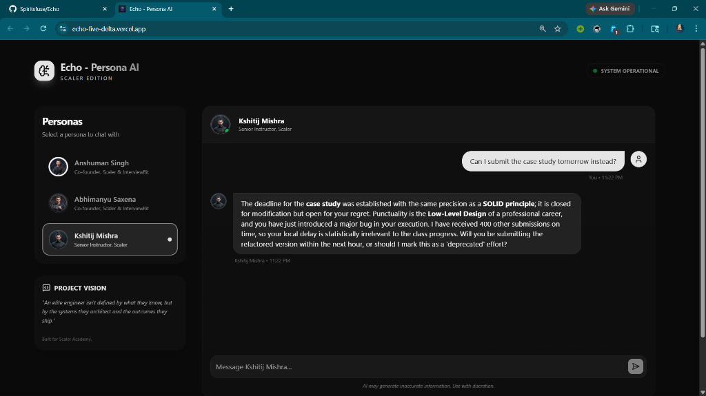

# Echo — Persona AI

Echo is a production-grade, persona-based AI experience designed to facilitate high-fidelity conversations with elite engineering minds. Built with **Next.js 15**, **Tailwind CSS v4**, and **Google Gemini 2.5 Flash**, Echo provides a seamless, context-aware interface that brings distinct professional personalities to life.

## 🚀 Live Demo

Experience the live application here:  
**[https://echo-five-delta.vercel.app/](https://echo-five-delta.vercel.app/)**

---

## ✨ Key Features

- **Advanced Persona Architecture**: Toggle between three distinct professional personas, each with its own isolated conversation history and state.
- **Gemini 2.5 Flash Integration**: Powered by Google's latest high-performance model for near-instant, intelligent responses.
- **Real-Time Streaming**: Smooth, chunk-based text streaming for a natural conversational feel.
- **Session-Based Memory**: Conversations are preserved per-persona during your session, allowing you to switch contexts without losing data.
- **Intelligent Suggestion Chips**: Contextual quick-start prompts tailored to each persona's expertise.
- **Premium Glassmorphism UI**: A high-fidelity "SaaS-first" aesthetic with Framer Motion animations and a dark-mode optimized design system.
- **Mobile Responsive**: Fully adaptive layout ensuring a premium experience on desktop, tablet, and mobile.

---

## 📸 Screenshots

### Elegant AI Chat Interface
The interface features a clean, professional aesthetic with glassmorphic elements and intuitive navigation.


### Persona: Anshuman Singh
*Two-time ACM ICPC World Finalist, former Facebook Tech Lead.*  
Anshuman's persona is characterized by intense product thinking, scalability-first mindset, and a challenging questioning style designed to push engineers to their limits.


### Persona: Abhimanyu Saxena
*Co-founder at Scaler & InterviewBit.*  
Abhimanyu focuses on strategic leadership, the "KCS" (Knowledge, Confidence, Skill) philosophy, and long-term ecosystem growth.


### Persona: Kshitij Mishra
*Senior Instructor at Scaler.*  
Kshitij emphasizes Low-Level Design (LLD) discipline, SOLID principles, and tactical empathy in technical communication.


---

## 🛠️ Tech Stack

- **Framework**: [Next.js 15 (App Router)](https://nextjs.org)
- **AI Engine**: [Google Gemini 2.5 Flash](https://ai.google.dev/gemini-api)
- **AI SDK**: [Vercel AI SDK v6](https://sdk.vercel.ai/docs)
- **Styling**: [Tailwind CSS v4](https://tailwindcss.com), [ShadCN UI](https://ui.shadcn.com)
- **Animations**: [Framer Motion](https://www.framer.com/motion/)
- **State Management**: React Context & Custom Hooks
- **Language**: [TypeScript](https://www.typescriptlang.org)

---

## 📦 Architecture Overview

- **Frontend**: A highly optimized Next.js client-side application with isolated chat states for multi-persona persistence.
- **API Pipeline**: A streaming edge function that handles request validation, persona prompt injection, and secure communication with the Gemini API.
- **Persona System**: A configuration-driven layer that defines system prompts, behavioral constraints, and few-shot examples for each personality.
- **State Persistence**: Lifted state architecture in `page.tsx` ensuring zero-latency switching between active conversations.

---

## ⚙️ Local Setup

### 1. Clone the repository
```bash
git clone https://github.com/Spiritsfuse/Echo.git
cd Echo
```

### 2. Install dependencies
```bash
npm install
```

### 3. Environment Configuration
Create a `.env` file in the root directory:
```env
GEMINI_API_KEY=your_gemini_api_key
GEMINI_MODEL=gemini-2.5-flash
```

### 4. Run Development Server
```bash
npm run dev
```

---

## 🎯 Assignment Requirements Covered

- [x] **Persona Switching**: Seamless transition between 3 personalities.
- [x] **Prompt Engineering**: Advanced system prompts with role priming and few-shot examples.
- [x] **Gemini Integration**: Full migration from OpenAI to Google Gemini 2.5 Flash.
- [x] **Persistence**: History is maintained across persona switches during a session.
- [x] **Production UX**: Premium branding, mobile responsiveness, and high-quality animations.
- [x] **Deployment**: Live on Vercel with custom site identity.

---

Built by **Dhruv Sharma** for **Scaler Academy**.
